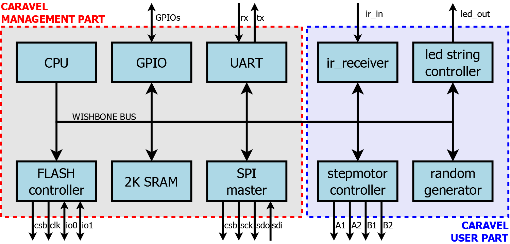
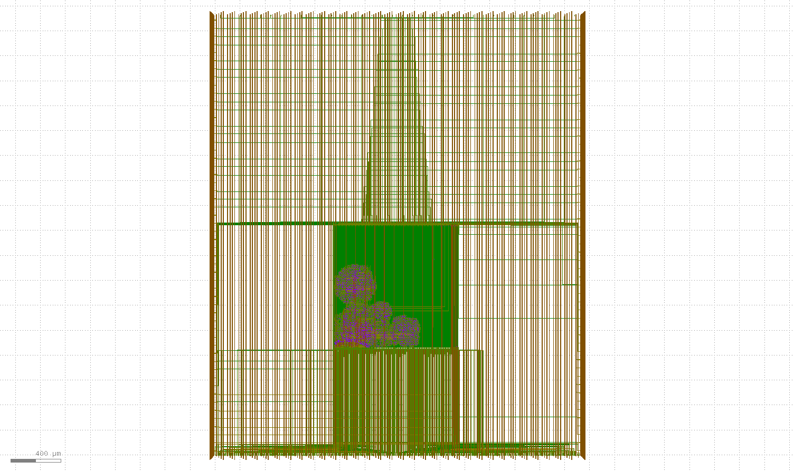

# Christmas tree controller (ASIC)

 

A Christmas tree controller that include  :
 - Infrared receiver (protocol NEC)
 - StepMotor controller (full-step, half-step, with strenght control)
 - Led string controller (compatibles WS2812B)
 - Pseudo-rendom generator (32bits)

Below is a representation of the architecture:

Below is a representation of the ASIC layout:

